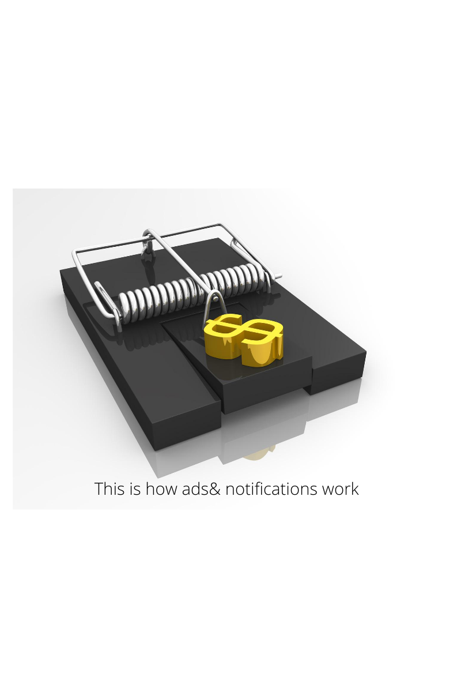
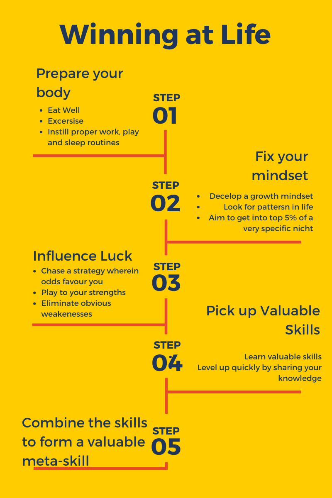

###### Coming out as an addict and an attempt to rebuild my life

# Opium has never ceased to fascinate me

The more I read about this drug, the more light it throws on how it shaped the geopolitics of the last Millenium. China is in the news for all the wrong reasons in 2020. But did you know that it was the victim of two Opium wars ?

Yes, a war over a drug. 

No, not a war to loot stashes of opium from the oriental treasures of China but to enable supply of Opium into China. 
Surprising isn't it ? 
Virtually all wars we hear of are fought to take something from a country. Then why would the British and the French attack the Chinese to give them something ?

When you dig deeper than the name of the war, you realise that it was not waged just for this one substance. Trade was not the primary motive for the attack (it was secondary). The main reason why the colonial powers fought this war was to destabilise the Chinese society and bring down the Chinese Empire, one of the surviving two strong foes to western powers. The other was Japan, which stood tall until two nuclear bombs were dropped on it. 

How did one substance lead to the decline of the Mighty Ming Empire ? 
To understand its effects better let us take a closer look home

This is Jahangir, the fourth Mughal Emperor.  The Mughal dynasty ruled over virtually all of India. All rulers of this dynasty were males, with no record of any significant achievements by any woman associated with the court (plenty of documented atoricties by the Mughals against women all over India but more on that in some other post). 

During Jahangir's reign however, a lady had a de facto control over all functioning for a large time period. How ? you may ask. It was because Emperor Jahangir was so addicted to Opium and alcohol that he was not in a condition to take any decisions. His wife Nur Jahan controlled all preceding. Since there's no record of a collapse of the empire, we'll assume she did a good job.

If a king with access to vast riches, numerous concubines and unlimited power could not control his cravings. Now you see the devastating effects that can arise if the general population is addicted.

## A modern war fuelled by addiction
Our society is under  a similar attack. We're being fed something more addictive than opium. This substance is

1. Easily available to everyone
2. Cosumable throughout the day
3. Totally harmless in appearance.  

Before examining this addiction in general, let us look at 4 phases of addiction defined by Nir Eyal, a bestselling author on consumer psychology.

### Components of addiction
Addiction is fundamentally the habit of repeatedly consuming a substance.

#### 1. Trigger

Your senses are persistently attacked in this stage. This is achieved by placing multiple cues in places where your senses can pick them up.

Some Trigger points in this case:
1. Notification bar
2. Notification sound
3. Email
4. Ads

   

#### 2. Action

This phase deals with the craving that you develop after noticing a cue. In order to satisfy this craving you perform certain actions the product designers hope you do. 
This is the phase in which you spend (read: waste) most of your time once you are addicted. 
More often than not, these actions in their initial occurrences make you feel like you are acting against your own rationale. Regardless, you keep performing these in expectation of some reward.

##### Examples of  such actions 
1. Mindless scrolling through feeds
2. Switching to slack after being distracted by a notification/ping  while working.
3. Pulling out your phone when alone.

   
#### 3. Reward
   
Addictives by very design are meant to provide you with a reward that is
1. Pleasurable
2. Very short term
3. Cognitively non-demanding to obtain.

### Some examples
1. Likes
2. Streak count
3. Social validation in group chats

#### 4. Investment
The final stage of the addiction cycle.
The intelletual/monetary/social investment that we make in these products serves as the fuel to drive further cycles in the future.

### We are all addicted.

Using the above 4-step hook cycle, we're constantly being attacked. 

Our enemy is not any country. 

They are not drawing battle plans in some control room. 

They are not clad in uniforms or decorated with medals.

They wear geeky t-shirts.

They are constantly innovating new strategies to keep you tied to their platforms.

They are product designers.

The only way to keep us  hooked is to get us addicted to their product's offering. And all modern product offerings boild down to one thing:

#### We're being made addicted to : Information

###### Thanks to the internet, information is now more easily available than any point in history. 
With this abundance comes an array of options to spend your time pretending that you are  learning something of value. 
 

### My addiction story

I am not really addicted  to social media.I used to be back when I newly discovered this digital world. Over time I realised it is not conducive for myy growth. I was succesful in gradually cutting down social media usage.
 
But I did not just eliminate it. I replaced it with mindless learning.In my professional life and my passion fields I started latched on to every new tutorial that came out, every new article that got published. I was addicted to consuming information.

Information consumption isn't inherently bad. One would argue that time spent learning is hardly wasted. But there is no justification to the time you invest learning something until you have something valuable to show for it.

And this lack of presentable evidence of growth has been my biggest source of frustration for the last two years. I have never been one to chase superficial rewards or achievements. I carry an in-built tendency to play the long game instead of seeking short term gains (I will put it down to good parenting and perhaps genetics).

 But over the last two years some events have occurred which have shown me the value of time. I have lost some dear ones, nearly lost others, and theese experiences taught me one important lesson :

>> Your life's most important metric is the impact you have on people around you.

Here's some traits I love of this metric:

1. It is independent of your financial status .
2. Your age is irrelevant.
3.  You can improve it no matter what your situation is. 

Having a positive impact on people is as easy as being more kind. To be kind, you need to have something valuable to offer. There are some valuable offerings that anyone can make , like time and intellectual advice. 

However, these resources are finite. 

1. There is a limited amount of time you can offer to others.
2. The value that you can offer in this limited time depends on the difference between yours and the other person's intellectual/emotional condition.

After a while you stop being valuable to others. You have to spend an increasing amount of time on yourself and your own endeavours. And your intellect/EQ is dependent on your skillset. I realised that passive knowledge was not helping me in either of the two factors. 

I wasn't progressing in life. I was only adding more rote learning to my brain. In other words I was becoming an ultimate disciple of something that I despise from the bottom of my heart : Indian education system.

I had to get rid of this addiction and start producing outcomes. I had to refactor my life.

Refactoring is one of my favourite words from computer science. For those unaware, here's the definition:

> Refactoring
  >> Refactoring is a disciplined technique for restructuring an existing body of code, altering its internal structure without changing its external behavior. At its heart is a series of small behavior preserving transformations.

I'm in constant awe of how relatable computer science terminology is to real life. Relating the aboce definition to my life :

- If I am to instill positive changes in my life, I need a disciplined approach. Randomly trying out multiple techniques won't make the cut.
- These changes have to be small and incremental for them to stick.
- I have already built up a vast body of knowledge. I do not have to start from scratch but simply rearchitect how this knowledge body is structured.

If you've read this far , you now know the reasoning behind the naming of this blog. After stalling on launching this blog for many months in search of an SEO friendly / Trending name (one of many such excuses) I have decided to go with a name close to my heart. A name that symbolizes what I can offer to the world, what I can offer myself. 

### My plan to tackle
I cannot eliminate my information  consumption addiction. All The cues are still there . My job as a web developer and my hobby of quizzing ensure that I have to constantly sift through new information. But I can grab this addiction right by its cues and bend it to will. 
What I intend to do is attack the cues and the rewards in such a way that it nudges my cravings and actions towards long term gains instead of short term.

That means :

1. Forming a knowledge base and adding only that information to it which aid my goals. Which brings me to point number two:
2.  Have definite long and medium term goals.
3.  Start processing information and producing tangible output (like this blog)

### a booky formula for **success**

One of my all time favourite books: How to fail at almost everything and still win big is penned by Scott Adams, the creator of popular comic strip Dilbert. In the book Scott lays out a model of success by reverse engineering his life.

#### Sucees Model

## What can you expect from refactored life blog ?

###### 1.  Self-help tips

I have read over an average, a book a month since 2017. I vaguely remember the useful bits of those. Starting August 2020 I have committed myself to revisiting those ideas and apply them to my life. But I do not want to keep those to myself. I shall be sharing the very best ideas here. I will pair those with few actionable steps. After all, self-help tips without any implementation is just intellectual porn.

######  2. Guides on how to succeed in the digital economy.

I shall not claim any authority over this topic until I generate a meaningful source of income. However I have spent a tremendos amount of time analyzing successful (and spectacularly unsuccessful) people. Some patterns have repeatedly emerged out of these studies. I'll be rigorously subjecting some guinea pigs (mostly myself) to these patterns in the context of the modern economy and document the benefits and disadvantages of this process. I hope that in my endeavour to chart my own path to success I also leave breadcrumbs for others to follow. 

#### 3. High-level overview of programming concepts

Just like refactoring there are many other paradigms in computer science that were adapted from real life. By converse logic these are applicable to real life. I shall strive to break down these concepts in such a way that even a layman understands them, hopefully deep enough to apply in their lives.

##### 4. All of the above and more, in a visual format
I run a sister [page](https://www.instagram.com/refactored_life/) for this blog on instagram. Concise and more frequent content shall be posted there.

#### 5. Beyond everything, a journey towards finding my purpose

I am not a great talker.  I struggle to express my emotions verbally, a trait that I've been practicing to improve during this pandemic. 
(potato meme)

Written communication feels natural to me. Be it through texts or unorganized notes and journal entries. I want to channel this natural talent towards creating something valuable. Something through which I can communicate pertinent constructs.

This is an outlet for the voices inside my head.

This is a journey of self-discovery.

This is my life, refactored.